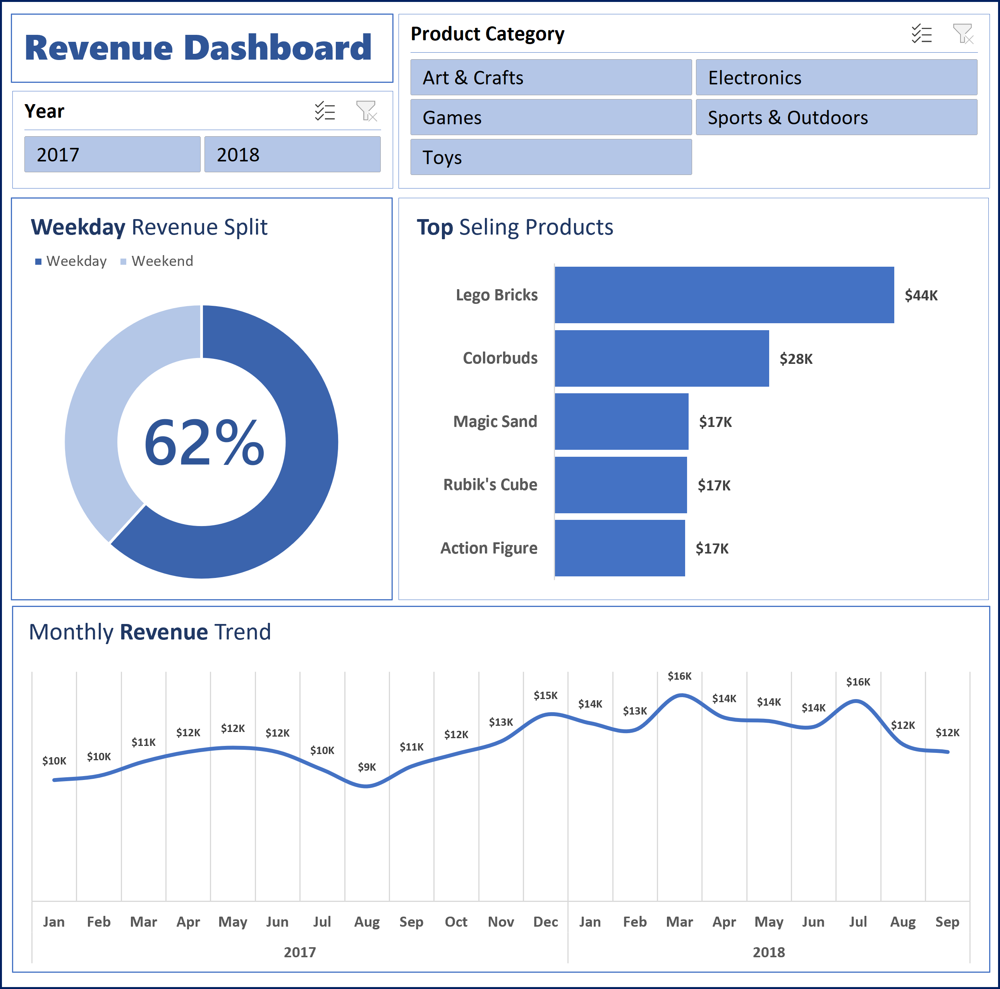

# Business Summary: Maven Toys Sales Analysis

## Company Name: Maven Toys
## Report Objective: To analyze revenue trends for weekdays and weekends, identify monthly performance trends, and determine the top-performing product.

## Executive Summary
This report provides insights into Maven Toys' sales data, focusing on revenue generation across weekdays and weekends, monthly sales trends, and identifying the highest-grossing product. All data cleaning, preparation, analysis, and visualization were performed in Microsoft Excel.
Key findings include:
Revenue by Day Type: Weekdays contributed 62% of the total revenue, outperforming weekends, which contributed 38%.
Monthly Trends: December generated the highest revenue ($15K) in 2017, attributed to the holiday season demand.
Top Product: The “Lego Bricks” emerged as the top product, contributing $44K in sales, 17% of the total revenue.

## Key Insights
Revenue Breakdown by Weekday and Weekend:
Weekdays: $160K (62% of total revenue)
Weekends: $99K (38% of total revenue)
Insight: The majority of sales occur during weekdays, indicating higher customer engagement during working days.
Monthly Revenue Trends:
Sales tends to increase in December citing December 2017 as an example.
Sales also appear to dip in August. 
Top Product Performance:
“Lego Bricks” was the most popular product, contributing $44K (17% of total revenue).
The second-best product, “Colorbuds” contributed $28K (11%).
The least popular product, “Magic Sand” generated $17K (7%).

## Recommendations
Focus on Weekend Promotions:
Leverage weekday sales by offering targeted discounts or campaigns to boost revenue further during these high-performing days.
Maximize Holiday Season Sales:
Increase stock and marketing efforts for top products like the “Lego Bricks” during December to capitalize on the holiday shopping spree.
Boost Underperforming Products:
Investigate why products like “Uno Card Game” underperform and implement targeted campaigns or redesigns to improve sales.

## Conclusion
The analysis highlights clear opportunities for Maven Toys to optimize sales strategies, especially on weekdays and during the holiday season. By acting on these recommendations, the company can sustain growth and maximize revenue potential.
Tool Used: Microsoft Excel (data cleaning, preparation, analysis, and visualization).

